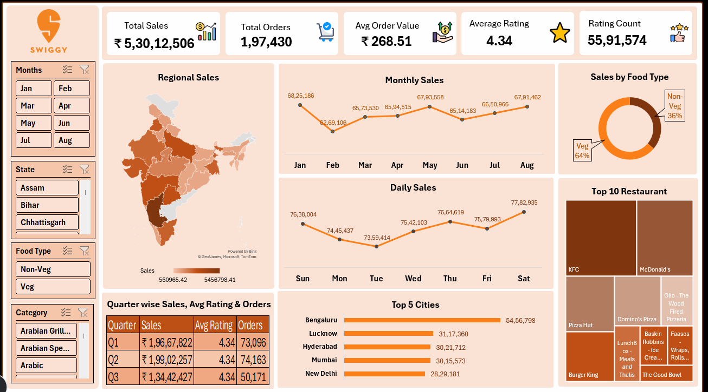

# 📊 Swiggy Sales Dashboard | Excel Project

## Project Overview

This project presents an interactive Swiggy Sales Dashboard built entirely in Microsoft Excel. The dashboard helps analyze restaurant sales performance, customer ratings, food preferences, regional sales distribution, and order trends through dynamic visualizations and slicers.
The objective of this project is to transform raw Swiggy sales data into meaningful business insights that support data-driven decision-making.

---

## Dashboard Preview

---

## Business Problem

Food delivery companies generate large volumes of transactional data daily. Analyzing this data manually is time-consuming and inefficient.

This dashboard helps stakeholders answer important business questions such as:

- Which cities generate the highest sales?
- What is the monthly sales trend?
- Which food type contributes the most revenue?
- Which restaurants perform best?
- Which regions have higher sales?
- How do ratings impact business performance?

---

## Key Performance Indicators (KPIs)

The dashboard tracks the following metrics:

| KPI | Value |
|------|--------|
| Total Sales | ₹5.30 Crore+ |
| Total Orders | 1.97 Lakh+ |
| Average Order Value | ₹268.51 |
| Average Rating | 4.34 |
| Rating Count | 55.9 Lakh+ |

---

## Dashboard Features

### 1. Sales Overview
- Total Sales
- Total Orders
- Average Order Value
- Average Rating
- Rating Count

### 2. Regional Analysis
- State-wise sales distribution using India Map Chart

### 3. Time-Based Analysis
- Monthly Sales Trend
- Daily Sales Trend
- Quarter-wise Performance

### 4. Food Category Analysis
- Veg vs Non-Veg Sales Contribution

### 5. Restaurant Performance
- Top 10 Restaurants by Sales

### 6. City Performance
- Top 5 Cities based on Revenue

### 7. Interactive Filters
Users can dynamically filter dashboard data using:
- Month
- State
- Food Type
- Category

---

## Tools & Techniques Used

- Microsoft Excel
- Power Query
- Pivot Tables
- Pivot Charts
- Slicers
- Conditional Formatting
- Map Charts
- Dashboard Design

---

## Business Insights

### Key Findings

- Veg food contributes approximately 64% of total sales.
- Non-Veg food contributes approximately 36% of total sales.
- Bengaluru is the highest revenue-generating city.
- Sales remain relatively consistent across months with slight peaks during May and August.
- KFC and McDonald's are among the top-performing restaurants.
- Certain states contribute significantly more revenue than others, indicating regional demand concentration.

---

## Project Structure

---

## Author

### Shakthi Sharma
